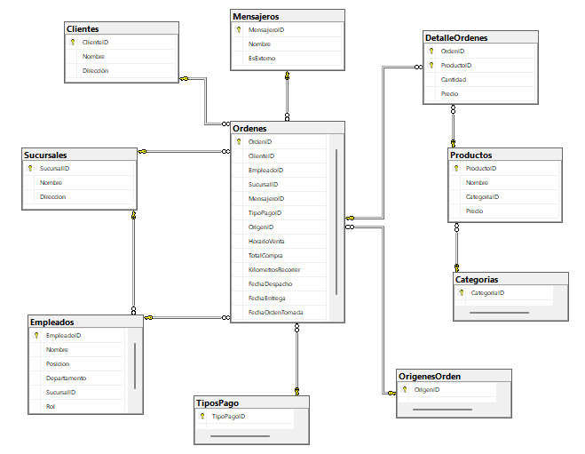

# FAST FOOD DB

Empresa de comida rápida que se encuentra en crecimiento y necesita gestionar la información de las nuevas sucursales para lograr un óptimo rendimiento.
Para poder dar respuesta a su requerimiento, se consolidó una base de datos centralizada donde se optimizan las consultas SQL con el fin de presentar  hallazgos claves sobre el desempeño operativo y las tendencias del mercado.

### Modelo Semántico

### Desarrollo del proyecto

Durante el primer avance del proyecto se trabajó en crear una base de datos relacional, donde se generaron las tablas necesarias y las relaciones correspondientes entre ellas.

En la siguiente instancia, se procedió a poblar las tablas con los datos proporcionados observando atentamente la compatibilidad entre el tipo de dato cargado y el tipo de dato asignado a cada campo de las tablas.

Los siguientes pasos dentro del  proyecto consistieron en  realizar varias consultas SQL con el fin de contestar preguntas claves que otorguen a la empresa un conocimiento más detallado del negocio para la toma de decisiones informadas que conlleven al éxito comercial.

### Optimización y sostenibilidad

Se llevó a cabo la normalización de datos, creando una base de datos sólida que permita escalar en base a las necesidades de Fast Food frente a su crecimiento comercial.

También se realizó indexación de los datos de las tablas con el fin de evitar datos duplicados o redundantes.

### EXTRA CREDIT

Se insertaron 20 nuevos registros en las tablas de “Ordenes” y “DetalleOrdenes”, lo que permitió obtener nuevos resultados a las consultas realizadas (NuevasConsultasPI.sql).

